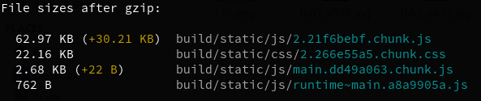

# Vuttr

## Tecnologias

- React
- [Reactstrap](https://github.com/reactstrap/reactstrap)
- [Styled Components](https://github.com/styled-components/styled-components) :lipstick:
- Eslint (Standard + Prettier) :triangular_ruler:
- Testes funcionais com [react-testing-library](https://github.com/testing-library/react-testing-library)
- [Webpack Bundle Analyzer](https://github.com/webpack-contrib/webpack-bundle-analyzer)

## Organização de pastas

- `src/`: Raíz do projeto
- `src/components/`: Pasta com os componentes compartilhados em toda a aplicação
- `src/__tests__`: Pasta com os testes funcionais

## Como executar

- Baixar dependências: `npm install` ou `yarn`
- Definir a URL base da API no arquivo `.env`
- Para executar em modo de desenvolvimento: `npm start` ou `yarn start`
- Para gerar o bundle de produção: `npm build` ou `yarn build`
- Para executar os testes: `npm run test` ou `yarn test`
- Para criar visualização do bundle de produção com webpack-bundle-analyzer: `npm run analyze` ou `yarn analyze`

## Bundle de produção com Preact :fire:

Visando diminuir o tamanho da aplicação final e entregar uma melhor experiência para o cliente, utilizar uma biblioteca com tamanho menor (~3KB) que tem compatibilidade com a API do React agregará bastante neste objetivo.

Os valores entre parênteses representam a diferença sem o uso do Preact.

